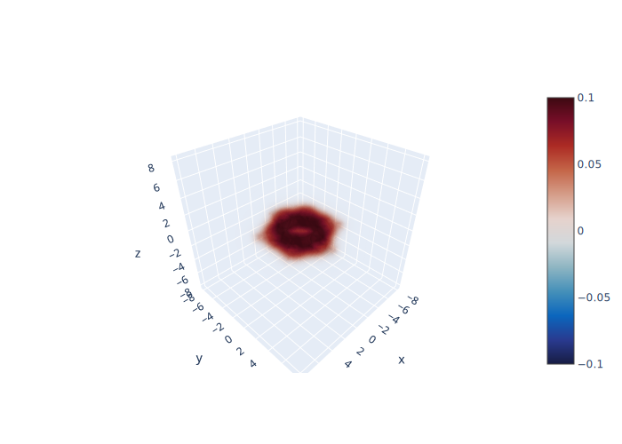
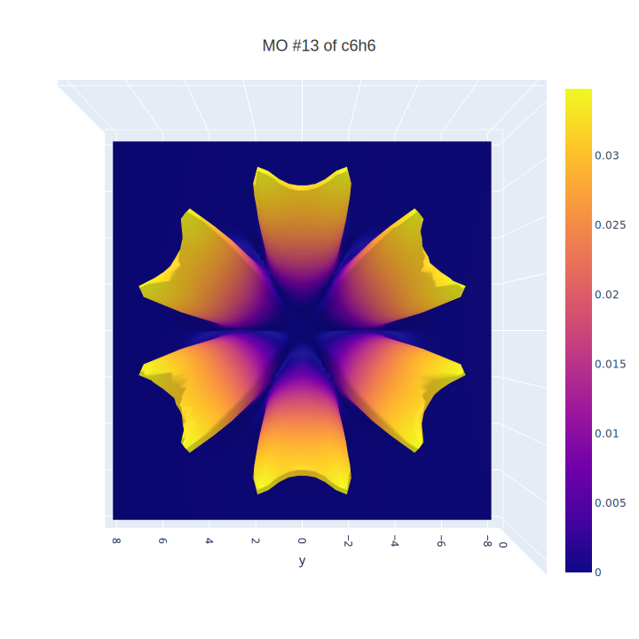

# Visualizing Wavefunctions

## Context

[One user](https://ask.bc-pf.org/u/sammael/summary) on [ask.bc-pf.org](https://ask.bc-pf.org) wondered whether there's software that can visualize molecular orbitals, reflecting their continious character. Software that I was aware of (Avogadro, JMol, GView) only plots a uniform isosurface, so I thought it'd be good to try to write the script that creates "fog plots".

## Overview

- [wrappers](wrappers/) -- endpoints for scripts. Start from here.
- [geometries](geometries/) -- if you want to plot MO of a molecule, you need to place its optimized geometry as a regular `.xyz` file in that folder.
- [tools](tools/) -- helper functions. Contain analytical forms of hydrogen AOs (required by [wrappers/hfwavefunctions.py](wrappers/hfwavefunctions.py))
- [output](output/) -- for svg, jpg, and html graphs.
- [modules](modules/) -- modules used by functions in [wrappers](wrappers/)

`wrappers/hydrogenaos.py` allows you to plot single AO functions of H or overlap of any two AOs as a function of internuclear distance. 

`wrappers/hfwavefunctions.py` allows you to plot MO based on RHF calculations.

You can plot MO in 3 different representations: as a heat map, as a surface, and a classical 3D representation.

## Highlights

## To-Do List

- [] Create a command based endpoint for `hfwavefunctions.py` so that you can specify molecule name, orbital to be visualized, and representation and get results.
- [] Improve documentation (add README.md to modules)
- [] Add docstrings
- [] Add tests?
